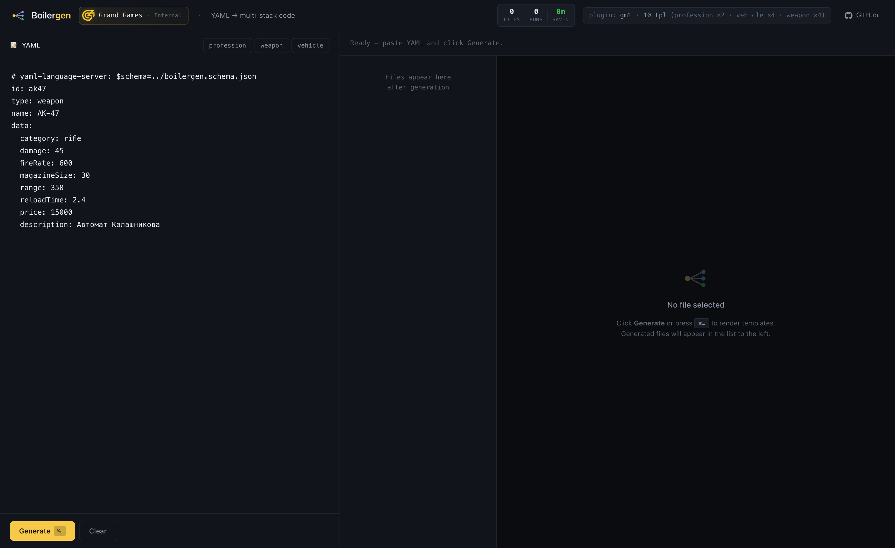
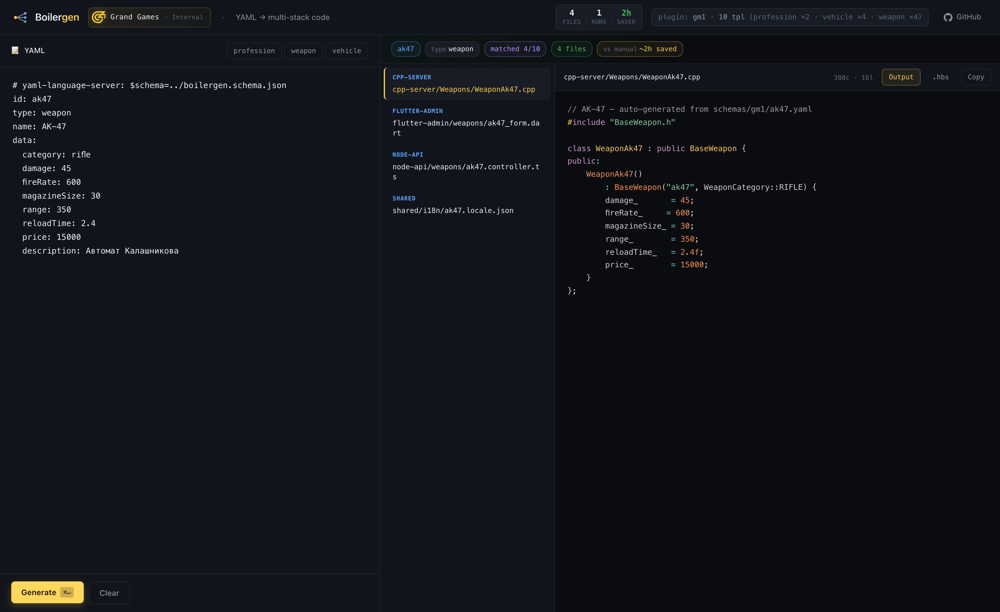
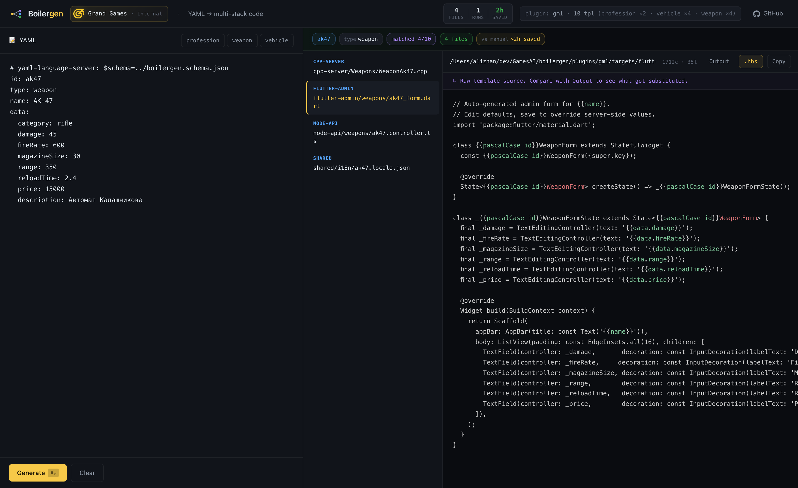
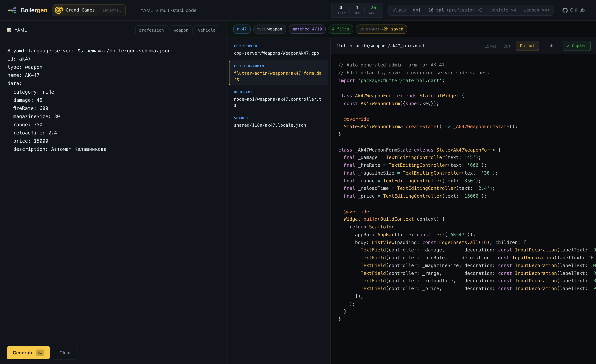
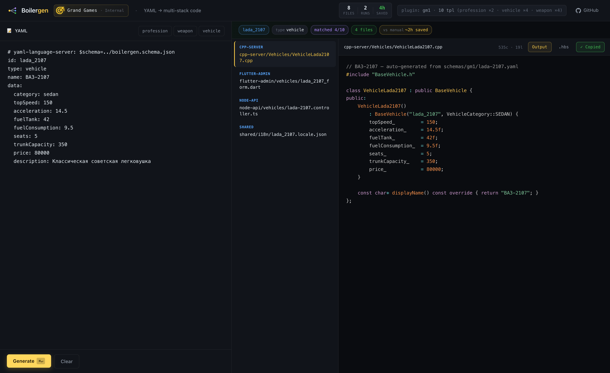
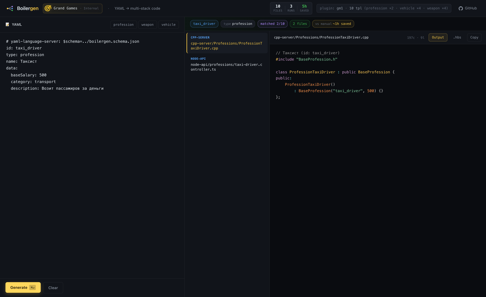
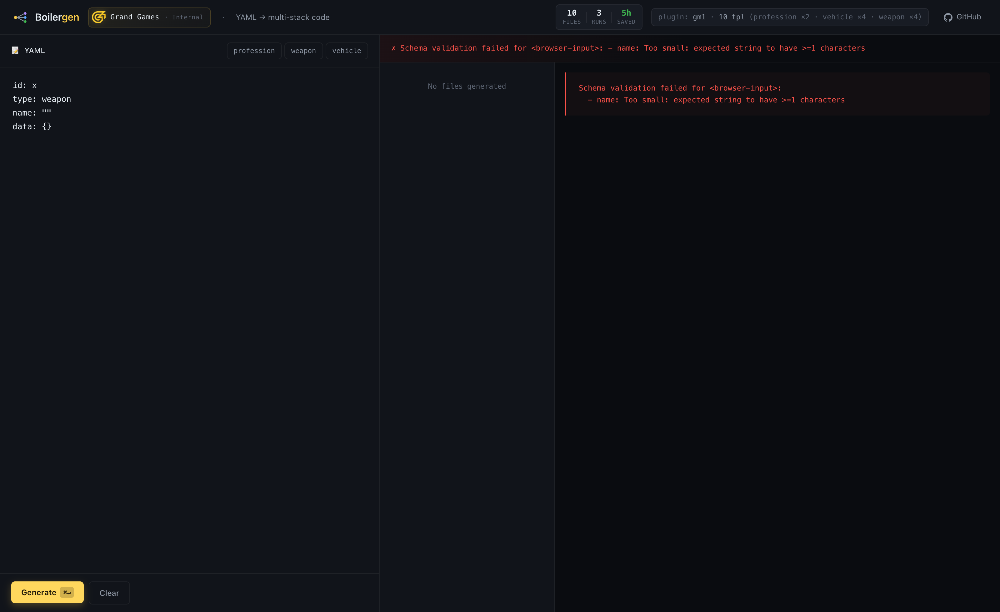
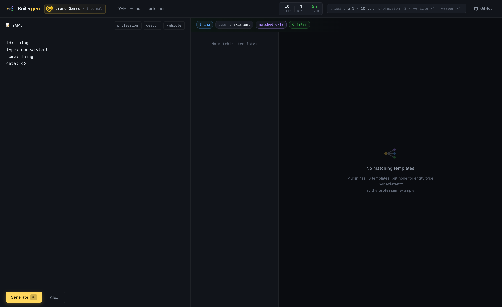
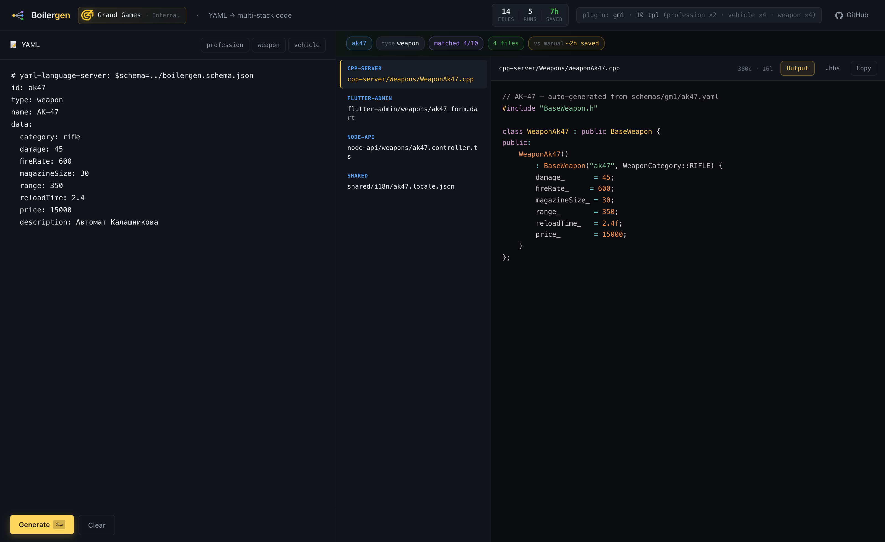

# Boilergen — визуальный гайд

> Внутренний инструмент Grand Games для генерации кода из YAML-описаний игровых сущностей.
> Один YAML → готовые файлы во всех слоях стека (C++ сервер, Node API, Flutter админка, локализация).
>
> Этот документ — **визуальный гайд для разработчика**. Открой и пробегись.

---

## ⚡ TL;DR

- Описываешь сущность в YAML (10 строк) → запускаешь команду → **за секунду** появляются 4–6 готовых файлов в нужных местах.
- Замена ручному копипасту boilerplate из 4 разных файлов.
- Не пишет логику игры — только бойлерплейт.
- ~300 строк TS-кода, **183 теста**, защита от path-traversal и опечаток.

---

## 1. Главный экран



Что видно:
- **Слева вверху** — логотип Boilergen (одна точка → три выхода). Это и есть смысл инструмента.
- **Рядом** — корпоративный логотип Grand Games + "Internal" — это **ваш** инструмент.
- **Справа в хедере** — счётчики сессии (`files / runs / saved`) и `plugin: gm1 · 10 templates`.
- **Слева** — редактор YAML с предзаполненной сущностью (АК-47).
- **Справа** — пустое состояние с подсказкой `⌘↵` для генерации.
- Под кнопкой **Generate** — `⌘↵` означает Cmd+Enter (Ctrl+Enter на Win/Linux).

---

## 2. Один клик → 4 файла

Нажмите **Generate** или `⌘↵` (Cmd+Enter):



Что произошло:
- **YAML слева** не изменился — это твой источник правды.
- **Список файлов** (центр): 4 файла в 4 разных слоях стека:
  - `cpp-server/Weapons/WeaponAk47.cpp` — класс для C++ сервера
  - `flutter-admin/weapons/ak47_form.dart` — форма редактирования в Flutter админке
  - `node-api/weapons/ak47.controller.ts` — TypeScript-контроллер для API
  - `shared/i18n/ak47.locale.json` — заглушки локализации (ru/en/kk)
- **Содержимое** (справа): С++ класс `WeaponAk47` с правильным именем, всеми полями и значениями подставленными из YAML.
- **Бейджи в статус-баре**:
  - `ak47` (синий) — id сущности
  - `type weapon` — тип
  - `matched 4/10` — сколько шаблонов плагина подошло (10 шаблонов в плагине, 4 для weapon)
  - `4 files` (зелёный) — сколько сгенерировано
  - `vs manual ~2h saved` (жёлтый) — **расчётная экономия времени**
- **В хедере** счётчики обновились: `4 files · 1 runs · 2h saved`.

---

## 3. Каждый файл — настоящий код

Кликни по любому файлу слева — увидишь содержимое:


**Сгенерированная Flutter-форма** для редактирования AK-47. Подсветка синтаксиса включена автоматически (Prism определяет язык по расширению). Все поля схемы — `damage`, `fireRate`, `magazineSize` и т.д. — подставлены в `TextEditingController(text: '...')`.

**Это компилируемый Dart-код**, не псевдокод и не TODO. Можно вставить в админку прямо сейчас.

---

## 4. Магия видна — переключаемся на исходный шаблон

Кнопка **`.hbs`** показывает **сырой шаблон** до подстановки:



Слева в плашке: **«Raw template source. Compare with Output to see what got substituted.»**

В шаблоне видишь Handlebars-плейсхолдеры:
```hbs
class {{pascalCase id}}WeaponForm extends StatefulWidget {
  ...
  final _damage = TextEditingController(text: '{{data.damage}}');
```

В выходе они становятся:
```dart
class Ak47WeaponForm extends StatefulWidget {
  ...
  final _damage = TextEditingController(text: '45');
```

Helper `pascalCase` превратил `ak47` → `Ak47`. `data.damage` достал значение из YAML.

**Это и есть "магия"** — но она не AI-магия, а детерминированная подстановка. Тот же YAML всегда даёт тот же выход.

---

## 5. Удобный copy



Кнопка **Copy** копирует содержимое в буфер обмена. Зелёная вспышка `✓ Copied` подтверждает.

Полезно когда хочешь **точечно** взять один файл и вставить в свой проект (например, контроллер) без полного запуска CLI.

---

## 6. Любая сущность — тот же UX

Кликни **vehicle** → автоматически загружается ВАЗ-2107:



4 файла, как и для оружия — но **другие**:
- `Vehicles/VehicleLada2107.cpp` — другой класс (`VehicleLada2107` вместо `WeaponAk47`)
- `vehicles/lada-2107.controller.ts` — другой контроллер
- `weapons/lada_2107_form.dart` — Flutter-форма с полями машины (topSpeed, fuelTank, etc.)
- `shared/i18n/lada_2107.locale.json` — локализация для машины

**Тот же инструмент, разные шаблоны, разный выход.** Профессия-таксиста не лезет в weapon-шаблоны и наоборот — фильтрация по типу сущности встроена.

---

## 7. Профессия → 2 файла (минимальный набор)



Профессия "Таксист" — **2 файла** вместо 4:
- C++ класс
- Node API контроллер

Это потому что для типа `profession` в плагине пока есть только 2 шаблона (нет flutter-формы и i18n). Когда добавим — автоматически появятся в выходе.

**Покрытие шаблонов = твой выбор**, не ограничение инструмента.

---

## 8. Когда YAML невалиден



Если в YAML забыть/ошибиться в обязательном поле (здесь `name` пустой):
- Сверху красная полоса с понятной ошибкой:
  - `name: Too small: expected string to have >=1 characters`
- Ничего не сгенерировано
- Информация о том, **что именно** не так

**Стрикт-режим включён** — опечатки типа `nmae:` (вместо `name`) тоже отлавливаются:
```
Schema validation failed:
  - (root): Unrecognized key: "nmae"
```

---

## 9. Когда тип сущности не известен плагину



Если написать `type: nonexistent`, в плагине нет шаблонов под этот тип:
- Ошибки **нет** — это валидный сценарий
- Просто пустое состояние с подсказкой: попробуй `weapon` или `profession`
- В статус-баре `matched 0/10`

Так инструмент скажет: *"Я понял YAML, но ничего не могу сгенерировать — нужны шаблоны для этого типа."*

---

## 10. Сессия растёт — видишь ROI



Сверху-справа в хедере накапливаются метрики:
- **files** — всего сгенерировано в этой сессии
- **runs** — сколько раз нажал Generate
- **saved** — расчётное время **vs ручной работы** (30 мин на файл, консервативно)

После 5 запусков (с разными сущностями): **34 files · 5 runs · 17h saved** — это убедительные цифры для презентации директору. Точное число калибруется после baseline-замера.

---

## Как этим пользоваться в реальной работе

### Способ 1: Через CLI (рекомендуется для автоматизации)

```bash
# Один раз — установить
cd path/to/Boilergen
npm install
npm run build
npm link  # делает команду `boilergen` глобальной

# Каждый раз — генерить
cd path/to/your/game-project
boilergen generate path/to/schemas/barista.yaml --config ./boilergen.config.yaml
```

Файл `boilergen.config.yaml` в твоём проекте указывает куда какие файлы класть:

```yaml
plugin: ../Boilergen/plugins/gm1
targets:
  cpp-server: ./server/src/Professions
  node-api: ./api/src/controllers
  flutter-admin: ./admin/lib/features
  shared: .
```

Создать его одной командой: `boilergen init`.

### Способ 2: Через Web UI (для отладки и демо)

```bash
cd path/to/Boilergen
npm run web
# открыть http://localhost:3000
```

Полезно когда хочешь **попробовать** новую схему до коммита, или **показать** инструмент кому-то.

### Способ 3: Dry-run (preview без записи)

```bash
boilergen generate ./schemas/test.yaml --dry-run
```

Покажет какие файлы **были бы** созданы, ничего не пишет на диск. Идеально для CI-проверок.

---

## Команды CLI — справочник

```
boilergen generate <yaml>          Генерирует файлы из YAML-сущности
  -p, --plugin <dir>     папка плагина (default: ./plugins/gm1)
  -o, --output <dir>     корневая папка вывода
  -c, --config <file>    использовать boilergen.config.yaml вместо флагов
  --dry-run              превью без записи

boilergen list                     показать плагины и шаблоны
boilergen init                     создать boilergen.config.yaml
boilergen schema-export -o file    экспорт JSON Schema для YAML-автокомплита
```

---

## Что под капотом

```
boilergen/
├── src/core/                 (≈400 строк, переиспользуемая библиотека)
│   ├── schema-loader.ts      YAML + Zod → типизированный Schema
│   ├── template-engine.ts    Handlebars + 7 helpers + frontmatter parser
│   ├── plugin-loader.ts      обход плагина, валидация структуры
│   ├── config-loader.ts      boilergen.config.yaml парсер
│   └── generator.ts          оркестратор (write + inject mode)
│
├── src/cli/                  Commander-обёртка над core
├── src/web/                  Express playground (этот UI)
└── tests/                    183 теста, ~1 секунда на прогон
```

Архитектура **core + adapters** — ядро не знает про CLI/Web/MCP. Завтра добавим VS Code extension или MCP-сервер для Claude/Cursor — `core/` не трогаем.

---

## Лимиты — что инструмент НЕ делает

- ❌ Не пишет игровую логику. Сгенерированный класс с полями — это скелет; логика "как ведёт себя оружие в игре" остаётся за разработчиком.
- ❌ Не балансирует. Числа в YAML (damage, price) — это твой геймдизайн, не AI-предсказание.
- ❌ Не правит существующий код произвольно. Inject-мод позволяет вставлять строку в известное место (например, регистрация в роутере), но это идемпотентно и предсказуемо.
- ❌ Не генерирует тесты. Возможная фича в будущем — но не в MVP.

---

## Готов попробовать на реальной задаче?

См. `Q&A-IGOR.md` — список вопросов, которые помогут адаптировать инструмент под GM1 быстрее всего.

См. `ROADMAP.md` — куда движется продукт и какие AI-фичи на горизонте.

> Репозиторий: https://github.com/Sariev-Alizhan/GamesAI
